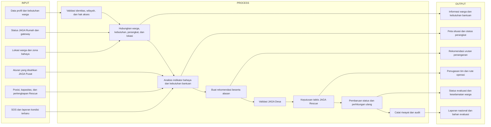
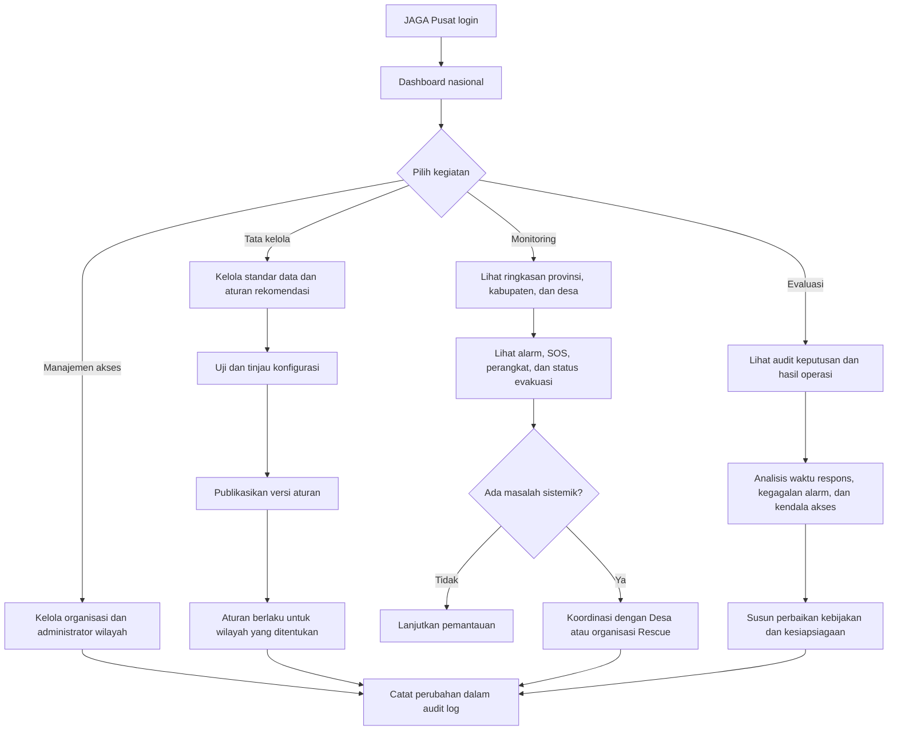
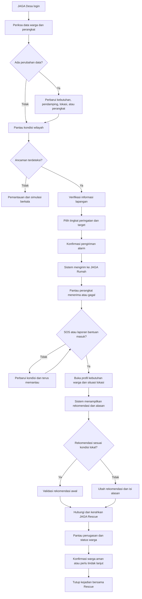
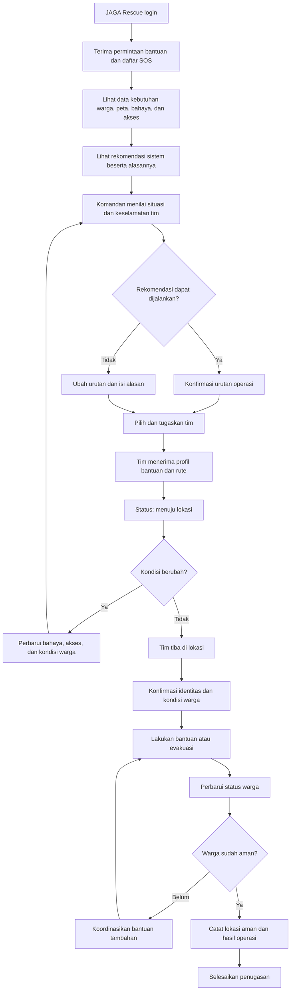
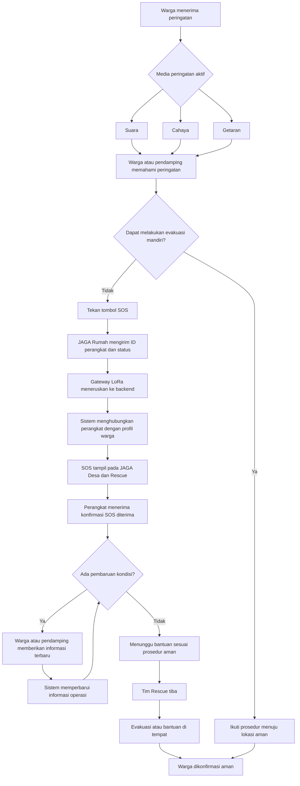

oke jadi ini aku bakal coba elaborasi ya sistem kita jadi sistem kita ada dua objek utama:

1. JAGA (Software)
2. JAGA Rumah (Hardware)

fitur di tiap objek:

1. JAGA Pusat:

* Pendataan warga disabilitas dengan triangle mulai dari desa lalu ke provinsi lalu ke nasional jadi dari desa lalu ke nasional yang utama tetap desa jadi sata nya terintegrasi.
* Role: JAGA Pusat, JAGA Desa, JAGA JAGA Rescue.
* lalu fitur yang menungkinkan admin menyalakan alaram di tiap rumah yang di install ke tiap rumah disabilitas untuk evakuasi.
* kemudian tiap peminimpin atau penanggung jawab dari JAGA Pusat dapat melihat data disabilitas di desa yang sudah di selamatkan jadi pemantauan disabilitas jadi lebih aware, yang mana mereka sering terlupakan dan memang harus mendapatkan perhatian khusu saat bencana.
* FItur menghubungi JAGA Rescue saat bencana.

2.  JAGA Rumah:

* Hardware yang berfungsi sebagai alaram unutuk rumah disabilitas dengan memberikan sinyal berupa suara, cahaya, dan getaran.
* lalu menggunakan LoRa dan baterai yang hemat karena hanya bekerja saat di aktifkan oleh tim JAGA Pusat.

3. JAGA Rescue:

* aplikasi yang sama yaitu JAGA tapi dengan role rescue atau sebagai tim penyelamat seperti damkar, tim SAR, dan organisasi kemanusiaan lainnya.
* lalu fitur map terintegrasi yang mempermudah tim rescue untuk locate rumah prioritas untuk di selamatkan.
* sistem pelacakan jejak pencarian untuk mempermudah tim penyelamat dalam tracking rute yang sudah mereka lalui sehingga mempermudah dan lebih efektif.
* kemudian saran rute penyelamatan tercepat dan efektif, sehingga jika di pedalaman ada rumah yang terisolasi jadi mudah di data. kemudian ada daerah yang rawan dan sulit di akses juga akan di highlight dengan warna merah, orange,  kuning.

jadi gimana menurut mu?

---

# Alur Operasional JAGA

## Prinsip pengambilan keputusan

JAGA adalah sistem pendukung keputusan, bukan pengganti keputusan petugas. Sistem
menyediakan informasi warga, kondisi kerentanan, lokasi, kondisi bahaya, status
perangkat, serta rekomendasi urutan penanganan yang dapat dijelaskan.

Pembagian tanggung jawab:

- **JAGA Desa** bertanggung jawab memutakhirkan data warga dan kondisi lokal,
  memvalidasi rekomendasi awal sistem, mengaktifkan peringatan, serta meminta
  bantuan Rescue.
- **Komandan JAGA Rescue** bertanggung jawab atas keputusan taktis dan urutan
  pelaksanaan evakuasi di lapangan berdasarkan kondisi nyata dan keselamatan tim.
- **JAGA Pusat** menetapkan standar dan konfigurasi aturan dasar, mengawasi
  operasi, serta mengevaluasi hasil dan audit keputusan.
- **Sistem JAGA** menghitung rekomendasi secara transparan, menampilkan alasan,
  memperbarui rekomendasi ketika kondisi berubah, dan mencatat setiap keputusan.

Petugas berwenang dapat mengubah rekomendasi sistem. Setiap perubahan wajib
disertai alasan dan disimpan dalam log audit. Jenis disabilitas tidak boleh menjadi
satu-satunya penentu. Penilaian mempertimbangkan kemampuan evakuasi mandiri,
kondisi bahaya terbaru, kebutuhan bantuan, keberadaan pendamping, akses lokasi,
dan sumber daya Rescue.

## Flowchart Input–Process–Output

## Flowchart logic JAGA Pusat

JAGA Pusat tidak memilih warga yang dievakuasi satu per satu. Pusat mengatur
standar, cakupan akses, pengawasan, dan evaluasi lintas wilayah.

## Flowchart logic JAGA Desa

JAGA Desa bertanggung jawab atas keakuratan informasi lokal dan keputusan awal,
tetapi keputusan taktis di lokasi operasi tetap berada pada komandan Rescue.

## Flowchart logic JAGA Rescue

Rescue berhak mengubah urutan karena kondisi lapangan dapat berbeda dari data
sistem. Sistem wajib menyimpan siapa yang mengubah, waktu perubahan, dan
alasannya.

## Flowchart logic warga pemegang kalung SOS

Jika jaringan internet terputus, komunikasi JAGA Rumah tetap dirancang melalui
LoRa menuju gateway. Perangkat perlu memberi umpan balik yang dapat dipahami
warga—misalnya pola cahaya atau getaran—ketika SOS sudah terkirim dan diterima.
