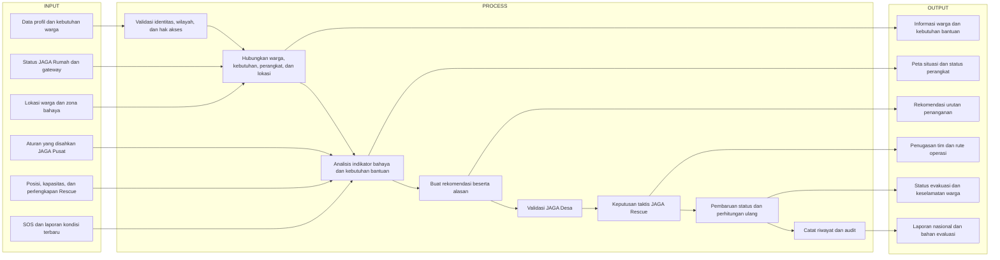
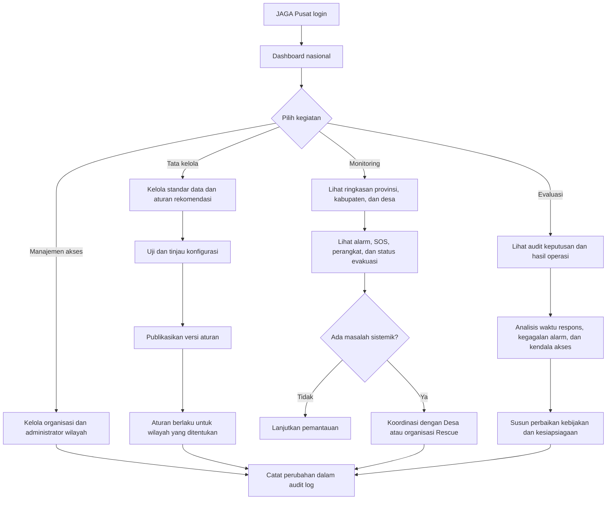
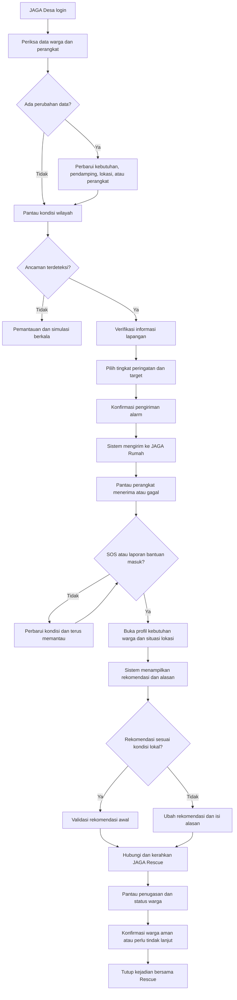
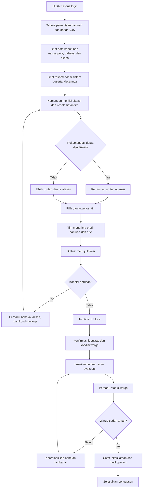
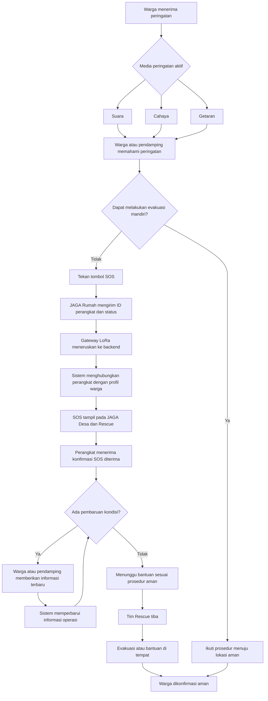

oke jadi ini aku bakal coba elaborasi ya sistem kita jadi sistem kita ada dua objek utama:

1. JAGA (Software)
2. JAGA Rumah (Hardware)

fitur di tiap objek:

1. JAGA Pusat:

* Pendataan warga disabilitas dengan triangle mulai dari desa lalu ke provinsi lalu ke nasional jadi dari desa lalu ke nasional yang utama tetap desa jadi sata nya terintegrasi.
* Role: JAGA Pusat, JAGA Desa, JAGA JAGA Rescue.
* lalu fitur yang menungkinkan admin menyalakan alaram di tiap rumah yang di install ke tiap rumah disabilitas untuk evakuasi.
* kemudian tiap peminimpin atau penanggung jawab dari JAGA Pusat dapat melihat data disabilitas di desa yang sudah di selamatkan jadi pemantauan disabilitas jadi lebih aware, yang mana mereka sering terlupakan dan memang harus mendapatkan perhatian khusu saat bencana.
* FItur menghubungi JAGA Rescue saat bencana.


2.  JAGA Rumah:

* Hardware yang berfungsi sebagai alaram unutuk rumah disabilitas dengan memberikan sinyal berupa suara, cahaya, dan getaran.
* lalu menggunakan LoRa dan baterai yang hemat karena hanya bekerja saat di aktifkan oleh tim JAGA Pusat.


3. JAGA Rescue:

* aplikasi yang sama yaitu JAGA tapi dengan role rescue atau sebagai tim penyelamat seperti damkar, tim SAR, dan organisasi kemanusiaan lainnya.
* lalu fitur map terintegrasi yang mempermudah tim rescue untuk locate rumah prioritas untuk di selamatkan.
* sistem pelacakan jejak pencarian untuk mempermudah tim penyelamat dalam tracking rute yang sudah mereka lalui sehingga mempermudah dan lebih efektif.
* kemudian saran rute penyelamatan tercepat dan efektif, sehingga jika di pedalaman ada rumah yang terisolasi jadi mudah di data. kemudian ada daerah yang rawan dan sulit di akses juga akan di highlight dengan warna merah, orange,  kuning.


jadi gimana menurut mu?

---

# Alur Operasional JAGA

## Prinsip pengambilan keputusan

JAGA adalah sistem pendukung keputusan, bukan pengganti keputusan petugas. Sistem
menyediakan informasi warga, kondisi kerentanan, lokasi, kondisi bahaya, status
perangkat, serta rekomendasi urutan penanganan yang dapat dijelaskan.

Pembagian tanggung jawab:

- **JAGA Desa** bertanggung jawab memutakhirkan data warga dan kondisi lokal,
  memvalidasi rekomendasi awal sistem, mengaktifkan peringatan, serta meminta
  bantuan Rescue.
- **Komandan JAGA Rescue** bertanggung jawab atas keputusan taktis dan urutan
  pelaksanaan evakuasi di lapangan berdasarkan kondisi nyata dan keselamatan tim.
- **JAGA Pusat** menetapkan standar dan konfigurasi aturan dasar, mengawasi
  operasi, serta mengevaluasi hasil dan audit keputusan.
- **Sistem JAGA** menghitung rekomendasi secara transparan, menampilkan alasan,
  memperbarui rekomendasi ketika kondisi berubah, dan mencatat setiap keputusan.

Petugas berwenang dapat mengubah rekomendasi sistem. Setiap perubahan wajib
disertai alasan dan disimpan dalam log audit. Jenis disabilitas tidak boleh menjadi
satu-satunya penentu. Penilaian mempertimbangkan kemampuan evakuasi mandiri,
kondisi bahaya terbaru, kebutuhan bantuan, keberadaan pendamping, akses lokasi,
dan sumber daya Rescue.

## Flowchart Input–Process–Output



## Flowchart logic JAGA Pusat



JAGA Pusat tidak memilih warga yang dievakuasi satu per satu. Pusat mengatur
standar, cakupan akses, pengawasan, dan evaluasi lintas wilayah.

## Flowchart logic JAGA Desa



JAGA Desa bertanggung jawab atas keakuratan informasi lokal dan keputusan awal,
tetapi keputusan taktis di lokasi operasi tetap berada pada komandan Rescue.

## Flowchart logic JAGA Rescue



Rescue berhak mengubah urutan karena kondisi lapangan dapat berbeda dari data
sistem. Sistem wajib menyimpan siapa yang mengubah, waktu perubahan, dan
alasannya.

## Flowchart logic warga pemegang kalung SOS



Jika jaringan internet terputus, komunikasi JAGA Rumah tetap dirancang melalui
LoRa menuju gateway. Perangkat perlu memberi umpan balik yang dapat dipahami
warga—misalnya pola cahaya atau getaran—ketika SOS sudah terkirim dan diterima.

---

# Akses Data Warga oleh JAGA Rescue

Prinsip: Rescue hanya melihat data pribadi warga **saat ada operasi**, dan hanya untuk **pemakai kalung** di **area terdampak**.

1. JAGA Desa menilai kondisi lapangan (tanpa sensor: pengetahuan Keuchik/pemuda desa, mis. "air sungai naik, titik rendah dusun X sudah 1 meter").
2. Desa memilih dusun terdampak dan membunyikan alarm Siaga/Evakuasi (boleh mengisi tinggi air dan catatan pengamatan).
3. Sistem otomatis membuka **operasi**; JAGA Rescue di wilayah itu menerima pemberitahuan dan roster pemakai kalung di area tersebut,
   termasuk paket offline untuk dibawa ke lapangan.
4. Desa dapat memperluas area atau memperbarui tinggi air selama operasi; alarm berikutnya meningkatkan operasi yang sama.
5. Setelah selesai, Desa menutup operasi dan akses Rescue dicabut. Semua pembukaan data oleh Rescue tercatat di audit.

Komandan Rescue tetap menentukan tim dan urutan evakuasi; sistem hanya menyediakan data dan rekomendasi.

---

# Tampilan per Role

**Navbar atas** (semua role) memuat logo, penanda "JAGA Pusat / Desa / Rescue" beserta wilayahnya, status koneksi, notifikasi, dan menu akun.
Menu halaman semua role (Pusat, Desa, Rescue) berada di **sidebar kiri**; navbar atas hanya memuat identitas, status, notifikasi, dan akun. Mode tab
di bawah navbar masih tersedia sebagai opsi (`nav: 'tabs'` per role di `ROLES`, `frontend/app.js`). Di layar sempit sidebar menjadi baris menu yang dapat digeser. Palet warna diturunkan dari logo (hijau, latar krem).

| Role | Menu | Isi |
|---|---|---|
| **JAGA Pusat** | Ringkasan | KPI nasional, operasi aktif, hal yang perlu perhatian, aktivitas terbaru |
| | Monitoring desa | Tabel per desa (warga, kalung online, baterai rendah, sinyal terakhir, operasi) dan peta wilayah |
| | Data warga | Pandangan baca saja seluruh wilayah, dengan cari dan filter kelompok |
| | Aturan prioritas | Rule set aktif, ambang warna, daftar aturan beserta poin dan penjelasan |
| | Akun & akses | Daftar akun dan pembuatan akun Desa/Rescue/Pusat (memilih desa dari daftar) |
| | Laporan | Riwayat operasi dan kejadian, unduh CSV |
| | Log audit | Tindakan penting termasuk akses data warga oleh Rescue |
| **JAGA Desa** | Beranda | Operasi berjalan (ubah tinggi air, tutup), KPI, peta desa, hal yang perlu ditindaklanjuti, status warga |
| | Warga | Daftar, cari, filter kelompok, tambah warga (termasuk kemampuan evakuasi dan medis mendesak) |
| | Alarm & operasi | Pilih tingkat, area dusun, tinggi air dan catatan, pesan; konfirmasi manusia; riwayat alarm |
| | Kalung | Baterai, koneksi, terakhir aktif |
| | Kejadian | SOS dan aksi status (konfirmasi, aman, tutup) |
| | Peta | Peta desa dengan zona bahaya dan titik kumpul |
| **JAGA Rescue** | Prioritas | Peta berpin warna prioritas dan daftar urutan penyelamatan beserta alasannya |
| | Operasi | Roster pemakai kalung per operasi, unduh paket offline |
| | Tugas lapangan | Aksi status penanganan (terima, berangkat, tiba, evakuasi, aman) |
| | Tim | Status dan posisi tim; ubah status tim organisasi sendiri |
| | Peta | Peta operasi |

**Halaman depan (`/`)** bersifat publik untuk semua pengguna: penjelasan singkat, kartu tiga peran (Desa, Rescue, Pusat) yang masing-masing menuju
`/login?role=...`, alur kerja, penjelasan prioritas warna, dan catatan privasi. Pengunjung yang sudah masuk melihat tombol "Buka dashboard". Alur URL:
`/` (landing) → `/login` → `/app` (dashboard sesuai peran). Pada mode demo, halaman masuk mengisi akun contoh sesuai peran yang dipilih.

Peta memakai OpenStreetMap lewat Leaflet (tercantum di `frontend/vendor/leaflet`); membutuhkan internet untuk ubin peta, sedangkan pin
dan zona tetap tergambar tanpa ubin. Aset logo olahan (simbol transparan, versi putih, ikon PWA) ada di `frontend/assets`; berkas asli
`frontend/logo_jaga.jpeg` tetap disimpan.

---

# Prioritas Penyelamatan (warna di tampilan JAGA Rescue)

Pertanyaan: siapa yang perlu diselamatkan lebih dulu? **Tidak ada satu urutan resmi yang berlaku untuk semua kasus**, dan JAGA
tidak boleh menentukannya dari label kelompok saja (prinsip di bagian atas dokumen ini). Yang dipakai adalah prinsip triase yang
dapat dijelaskan: urutkan menurut *seberapa mendesak ancamannya* dan *seberapa mampu warga menyelamatkan diri*, lalu tambahkan
penanda kerentanan dengan bobot kecil.

## Urutan pertimbangan

1. **Ancaman langsung terhadap nyawa**: SOS aktif, air sudah masuk rumah (tinggi air), rumah di dalam zona bahaya, tinggi air umum yang
   diamati Desa.
2. **Tidak mampu menyelamatkan diri**: kemampuan evakuasi (mandiri, perlu bantuan, tidak bisa sendiri) dan apakah ada pendamping serumah.
   Orang yang tidak bisa mengungsi sendiri dan tinggal sendiri didahulukan.
3. **Kebutuhan medis yang tidak bisa ditunda**: insulin, oksigen, dialisis, persalinan dekat.
4. **Hambatan menerima peringatan**: tunarungu, tunanetra, disabilitas intelektual, autisme; perlu diberi tahu langsung.
5. **Penambah**: lanjut usia, hamil, tingkat kerentanan tinggi, akses desa sulit, malam hari, kalung offline, tanpa kontak darurat.

Konsekuensinya: penyandang disabilitas yang mandiri dan jauh dari bahaya tidak otomatis lebih prioritas daripada lansia yang tidak bisa
bangun dan tinggal sendiri; ibu hamil sehat berbeda dengan ibu hamil yang persalinannya dekat.

## Warna

| Warna | Level sistem | Skor (dummy) | Arti |
|---|---|---|---|
| Merah | DARURAT | 70 ke atas | Tangani lebih dulu |
| Oranye | RESPONS_CEPAT | 50 sampai 69 | Segera kirim bantuan |
| Kuning | SEGERA_TINJAU | 25 sampai 49 | Perlu ditinjau dan dipantau |
| Hijau | PANTAU | di bawah 25 | Pantau berkala |

Setiap kartu menampilkan alasan (aturan yang cocok) sehingga komandan bisa menilai dan mengubah keputusan. Warna berubah otomatis
saat kondisi berubah, misalnya Desa memperbarui tinggi air: pada data contoh, 1 warga merah pada air 40 cm menjadi 5 warga merah pada 120 cm.

## Bobot dummy (belum standar resmi)

| Aturan | Poin |
|---|---|
| SOS/insiden terbuka | +40 |
| Air di rumah ≥ 50 cm / ≥ 100 cm | +15 / +15 lagi |
| Zona bahaya risiko ≥ 4 (di dalam atau tepi) / risiko 3 | +15 / +8 |
| Tinggi air umum dari Desa ≥ 100 cm | +10 |
| Tidak bisa mengungsi sendiri / perlu bantuan | +30 / +10 |
| Tinggal sendiri | +15 |
| Medis tidak bisa ditunda | +30 |
| Sulit menerima peringatan (tunarungu, tunanetra, intelektual, autisme) | +10 |
| Hamil | +10 |
| Lansia | +5 |
| Tingkat kerentanan 4 atau 5 | +5 |
| Kalung offline | +10 |
| Akses desa sulit | +5 |
| Malam hari | +5 |
| Tanpa kontak darurat | +5 |

**Bobot ini hanya contoh untuk demo.** Sebelum dipakai di operasi nyata harus ditinjau dan disahkan JAGA Pusat bersama BPBD, Dinas
Sosial, bidan/tenaga kesehatan, dan organisasi penyandang disabilitas setempat. Aturan disimpan sebagai rule set berversi
(`priority_rule_sets`), jadi bobot dapat diubah tanpa mengubah kode.

## Data yang dibutuhkan agar prioritas akurat

- Kemampuan evakuasi mandiri dan kebutuhan medis mendesak harus diisi petugas desa (kolom terstruktur `evacuation_ability` dan
  `time_critical_medical`). Bila kosong, sistem tidak menebak dari teks bebas.
- Posisi rumah harus akurat agar status zona bahaya benar; zona bahaya perlu ditetapkan Desa/BPBD.
- Pada kehamilan, tingkat kerentanan (1 sampai 5) sebaiknya mengikuti usia kehamilan dan komplikasi, dan persalinan dekat ditandai medis mendesak.

## Keterbatasan saat ini

- Komandan Rescue baru dapat mengubah level lewat penilaian insiden (warga yang memiliki SOS); warga tanpa SOS belum bisa di-override.
- Belum ada pelatihan bobot dari data nyata; semuanya penilaian aturan yang dapat dijelaskan.

---

# Lokasi Pilot: Gampong Leubok Pusaka, Kec. Langkahan, Kab. Aceh Utara

Pilot memakai satu desa. Seluruh warga, kalung, tim, insiden, dan aturan skor adalah **dummy**;
yang nyata hanya data wilayah publik.

## Alasan memilih Leubok Pusaka

1. **Terdampak banjir Sumatra 26 November 2025.** Kompas melaporkan Dusun Tanah Merah di desa ini sebagai lokasi terparah banjir di
   Aceh Utara: air sekitar 5 meter dan sekitar 200 KK terdampak.
2. **Dampak terjadi di tingkat dusun.** Itu sesuai dengan desain sistem: JAGA Desa memilih dusun terdampak, lalu Rescue menerima
   roster pemakai kalung di dusun itu saja.
3. **Data wilayah resmi tersedia.** Kode wilayah 11.08.18.2021 (Kemendagri), kode pos 24394, Mukim Rampah, titik tengah 4°49'37"N
   97°24'58"E (Wikidata). Titik tengah dipakai sebagai pusat sebaran koordinat dummy.
4. **Skala pilot dapat dikecilkan.** Desa dilaporkan besar (sekitar 764 KK, 10 dusun, 2.286 jiwa pada data 2019; belum
   terverifikasi), sehingga pilot dibatasi pada **3 dusun**: Tanah Merah (nyata) dan dua dusun placeholder.
5. **Konteks lokal sesuai asumsi sistem.** Tanpa sensor, keputusan bergantung pada pengamatan Keuchik dan pemuda desa: "air sungai
   naik, titik rendah dusun X sudah 1 meter". Itulah masukan yang dicatat sebagai tinggi air dan area operasi.

## Skala data dummy

Dari angka yang dikumpulkan pemilik proyek, Aceh Utara memiliki sekitar 2.000 penyandang disabilitas. Dibagi rata per gampong
(sekitar 850; perlu dicek ke BPS) hasilnya sekitar 2 orang per desa. Fokus JAGA juga mencakup lansia dan ibu hamil, jadi seed
sengaja kecil dan seimbang: **satu desa, 3 dusun, 9 warga berkalung**.

| Kelompok fokus | Jumlah | Warga (fiktif) |
|---|---|---|
| Disabilitas | 3 | pengguna kursi roda, tunarungu mandiri, tunanetra |
| Lansia | 3 | pasca-stroke tinggal sendiri, lansia bertongkat tinggal sendiri, lansia dengan insulin |
| Ibu hamil | 3 | persalinan dekat, tinggal sendiri 7 bulan, 5 bulan sehat |

Varian kasus sengaja dibuat berbeda-beda (tinggal sendiri vs bersama keluarga, di dalam vs di luar zona bahaya, mandiri vs tidak bisa
mengungsi) supaya prioritas berwarna menghasilkan merah, oranye, kuning, dan hijau. Bila perlu lebih kecil lagi, kurangi warga di
`backend/src/seed.ts`. Tes otomatis memakai satu desa fixture tambahan (hanya saat `JAGA_TEST_FIXTURES=true`) untuk menguji isolasi
antar desa; fixture itu bukan bagian data pilot.

## Yang nyata dan yang dummy

| Nyata (publik) | Dummy / placeholder |
|---|---|
| Kode wilayah, nama desa/kecamatan/kabupaten, titik tengah desa | Nama warga, telepon (0812-0000-xxxx), kontak, kerentanan, catatan medis |
| Nama Dusun Tanah Merah dan laporan dampaknya (Kompas) | Dusun lain ("Dusun Contoh 2/3"), koordinat rumah |
| Fakta banjir 26 November 2025 | Zona bahaya (batas perkiraan), titik kumpul usulan, catatan akses |
| | Kalung, gateway, tim BPBD/Damkar, insiden, alarm, aturan skor (bukan standar resmi) |

## Keterbatasan dan hal yang perlu diverifikasi

- Jumlah KK, dusun, dan penduduk Leubok Pusaka berasal dari ringkasan pencarian; artikel sumbernya tidak dapat dibuka. Ada sumber yang
  menyebut desa ini di Kec. Seunuddon, tetapi Wikidata dan kode pos menempatkannya di Langkahan.
- Status desa pascabanjir (relokasi, dusun yang hilang) belum dicek. Dusun yang dilaporkan hilang (mis. Guci, Riseh) sengaja tidak dipakai.
- Daftar dan nama dusun sebenarnya harus diambil dari BPS ("Kecamatan Langkahan dalam Angka") atau Keuchik, lalu diganti di `seed.ts`.
- Proporsi disabilitas hanya asumsi. Jangan pernah mengganti data dummy dengan data warga sungguhan tanpa persetujuan dan dasar hukum (UU PDP).

---

# Integrasi Kalung (untuk tim perangkat)

Bagian ini cukup bagi tim kalung (JAGA Rumah) dan gateway; tidak perlu membaca kode backend. Contoh siap pakai: `firmware/api-examples.http`.

## Arsitektur

```
Kalung JAGA Rumah --LoRa--> Gateway --HTTPS--> Backend JAGA --> Dashboard Desa / Rescue
```

- Kalung dan gateway **tidak pernah** memegang kunci Supabase atau `.env`. Mereka hanya memegang kunci mereka sendiri.
- Kunci kalung berawalan `jrk_` (satu per kalung), kunci gateway berawalan `gtw_`. Keduanya dibuat saat didaftarkan (JAGA Desa/Pusat mendaftarkan kalung, JAGA Pusat
  mendaftarkan gateway) dan **hanya ditampilkan sekali**. Rotasi: `POST /api/devices/:id/key` atau `POST /api/gateways/:id/key`. Backend hanya menyimpan hash kunci.
- Transport LoRa antara kalung dan gateway ditentukan tim perangkat; backend hanya berbicara HTTP(S). Gateway menerjemahkan.

## Autentikasi (header)

| Header | Wajib | Isi |
|---|---|---|
| `X-JAGA-Device-Id` | ya | mis. `JAGA-0003` |
| `X-JAGA-Device-Key` | ya | kunci `jrk_...` kalung |
| `X-JAGA-Gateway-Key` | tidak | kunci `gtw_...`; disertakan bila lewat gateway |

Kunci hanya diterima lewat header (bukan query string). Kalung berstatus hilang atau dipensiunkan ditolak (403).

## Endpoint

| Metode dan jalur | Tujuan | Isi penting |
|---|---|---|
| `POST /api/device/telemetry` | Detak berkala | `battery` (0-100), `latitude`, `longitude`, `signalStrength`, `temperature`; semua opsional. Balas 202 |
| `POST /api/device/sos` | Tombol SOS | `latitude`, `longitude`, `description` opsional. Balas 201 dengan `ack: "SOS_DITERIMA"` dan `incidentId`; SOS yang masih terbuka tidak diduplikasi (`duplicate: true`) |
| `GET /api/device/inbox` | Ambil alarm | `commands[]`: `id`, `receiptId`, `severity`, `message`, `expiresAt`. Mengambil menandai terkirim |
| `POST /api/device/receipts/:receiptId` | Konfirmasi alarm | `{"status":"ACKNOWLEDGED"}` atau `{"status":"FAILED","reason":"..."}` |
| `GET /api/device/location` | Info perangkat | lokasi tersimpan, baterai, status |

Balasan sukses berbentuk `{"data": ...}`; galat berbentuk `{"error": "..."}` dengan kode 400 (isi salah, body maksimum 64 KB), 401 (kunci salah/tidak ada), 403 (perangkat hilang/dipensiunkan atau receipt milik perangkat lain).

## Alur yang harus didukung firmware

1. **Detak:** kirim telemetri berkala. Dashboard menganggap kalung **offline bila tidak ada sinyal lebih dari 15 menit** (`DEVICE_OFFLINE_MINUTES`), jadi interval harus lebih pendek dari itu (usulan 5 menit; baterai vs keandalan perlu dikompromikan).
2. **SOS:** tekan tombol, kirim `sos`, lalu beri umpan balik yang dapat dipahami warga (cahaya/getaran) saat `SOS_DITERIMA` diterima. Bila gagal terkirim, ulangi hingga berhasil (aman: tidak menduplikasi).
3. **Alarm:** terima perintah (lewat downlink dari gateway), jalankan pola sesuai `severity`, lalu kirim konfirmasi. Alarm kedaluwarsa pada `expiresAt`.
4. **Offline:** gateway mengantre dan mengirim ulang saat internet kembali.

## Pola alarm (USULAN, perlu disepakati dengan tim kalung)

| Tingkat | Cahaya | Getaran | Suara |
|---|---|---|---|
| WASPADA | kedip lambat | satu getar pendek | tidak ada atau nada lembut sekali |
| SIAGA | kedip sedang | getar putus-putus | nada berkala |
| EVAKUASI | kedip cepat | getar kuat terus-menerus | nada keras terus-menerus |

Kombinasi tiga media penting karena penerima mencakup tunarungu (cahaya/getaran), tunanetra (suara), dan lansia. Autisme: hindari sirene keras bila memungkinkan (catatan pada data warga).

## Yang belum ada di backend (perlu dirancang bersama)

- **Pengiriman alarm ke kalung masih tarik (polling `inbox`)**, padahal kalung dirancang hemat baterai dan aktif hanya saat dipicu lewat LoRa. Rencana: endpoint antrean
  keluar untuk **gateway** (gateway menarik semua perintah satu desa lalu meneruskan lewat LoRa). Belum dibuat; bentuknya perlu disepakati dengan tim kalung.
- Transport MQTT dan LoRa; sinkronisasi waktu perangkat; pembaruan firmware (OTA).

## Konfigurasi kalung dan gateway (di mana disimpan)

Seluruh kode dan konfigurasi perangkat berada di bawah `firmware/` (struktur di dalamnya diatur tim perangkat; usulan `firmware/kalung/` dan
`firmware/gateway/`). Nilai yang perlu dikonfigurasi:

| Nilai | Contoh | Rahasia? | Simpan di |
|---|---|---|---|
| Alamat backend | `https://api.contoh.id` (dev: `http://<ip-laptop>:3000`) | tidak | `config.example.*` (di-commit) |
| ID kalung | `JAGA-0003` | tidak | `config.example.*` |
| **Kunci kalung** | `jrk_...` | **ya** | `secrets.*` atau `config.local.*` (tidak di-commit) |
| **Kunci gateway** | `gtw_...` | **ya** | `secrets.*` atau `config.local.*`, hanya di gateway |
| Interval detak | 5 menit (harus kurang dari 15) | tidak | `config.example.*` |
| Coba ulang SOS | ulang sampai berhasil | tidak | kode firmware |

Berkas `secrets.*`, `config.local.*`, hasil build (`*.bin`, `*.elf`, `.pio/`, `build/`) sudah diabaikan git. Sediakan `config.example.*` berisi nilai contoh
agar anggota baru tahu apa yang harus diisi. Satu kalung satu kunci; jangan memakai kunci yang sama untuk banyak kalung.

## Cara menguji tanpa Supabase

```powershell
npm install
npm run build
$env:JAGA_FORCE_MEMORY = "true"; npm start     # data pilot dummy di memori, tanpa .env
node scripts/demo-device-keys.mjs              # ID dan kunci kalung/gateway demo
```

Akun dashboard demo ada di README. Kunci demo hanya berlaku pada data dummy memori dan tidak boleh dipakai di produksi.

---

# Kebutuhan Data

Data dibagi menjadi tiga jenis: **publik** (boleh diambil dari sumber terbuka), **dummy** (dibangkitkan; wajib untuk data
pribadi), dan **kebijakan** (perlu pengesahan, bukan sekadar data). Seed (`backend/src/seed.ts`) memuat pilot Aceh Utara (1 desa, 9 warga dummy).

| Data | Tabel | Jenis | Sumber / catatan |
|---|---|---|---|
| Wilayah (provinsi → desa, kode, koordinat) | `provinces`, `regencies`, `districts`, `villages` | Publik | Kode Kemendagri/BPS; repo daftar wilayah Indonesia (mis. `cahyadsn/wilayah`, `emsifa/api-wilayah-indonesia`); batas dan koordinat desa dari BIG. |
| Zona bahaya (banjir, longsor, gempa) | `hazard_zones` | Publik | InaRISK BNPB, PVMBG/Badan Geologi, BMKG; kejadian historis dari DIBI BNPB. Simpan juga pusat dan radius (`center_latitude/longitude`, `radius_meters`). |
| Titik kumpul dan shelter | `evacuation_shelters` | Publik | OpenStreetMap lewat Overpass (`amenity=school`, `community_centre`, `townhall`, `shelter`); data BPBD bila ada. |
| Akses jalan dan medan | `villages.access_notes` | Publik | OSM (`highway`, `surface`), diubah menjadi catatan akses yang dipahami `geo.ts`. |
| Penduduk dan statistik disabilitas | `villages.population` | Publik (agregat) | BPS (Podes, Susenas); dipakai menakar jumlah warga dummy yang realistis. |
| Warga, kontak darurat, kerentanan per orang | `residents`, `resident_contacts`, `resident_vulnerabilities` | **Wajib dummy** | Data disabilitas dan medis adalah data pribadi spesifik (UU PDP); jangan pakai data asli tanpa persetujuan. |
| Kalung, gateway, telemetri | `devices`, `gateways`, `device_telemetry` | Dummy | Hardware belum ada; simulasikan lewat `/api/device/*`. |
| Insiden, penugasan, alarm, notifikasi | `incidents`, `incident_assignments`, `alert_commands`, `notifications` | Dummy | Dibuat saat simulasi/uji. |
| Tim rescue dan anggota | `rescue_teams`, `rescue_team_members` | Dummy | Nama instansi (BPBD, Damkar, Basarnas) boleh nyata; personelnya fiktif. |
| Rule set dan bobot skor, ambang | `priority_rule_sets`, `priority_rules`, `priority_thresholds` | Kebijakan | Untuk demo cukup dummy; untuk operasi nyata harus disahkan Pusat bersama pakar (acuan: Perka BNPB No. 14/2014 tentang penanganan penyandang disabilitas dalam penanggulangan bencana; cek ulang nomor dan isinya). |
| Akun | `profiles`, `internal_accounts` | Dummy | Kata sandi demo publik hanya untuk mode memori. |

Rencana yang berlaku: wilayah, nama dusun yang terkonfirmasi, dan titik tengah desa dari data publik; seluruh data orang dan perangkat
dummy. Lokasi pilot, alasan, dan skala data ada di bagian "Lokasi Pilot" di atas.
