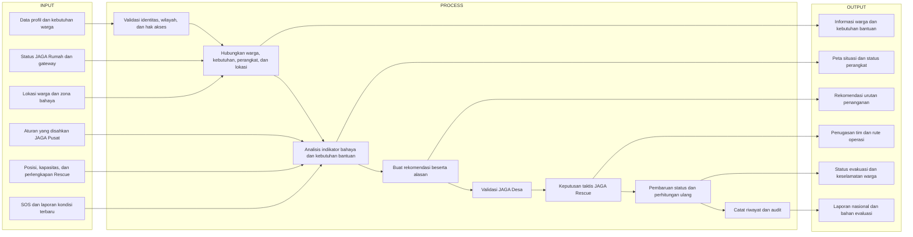
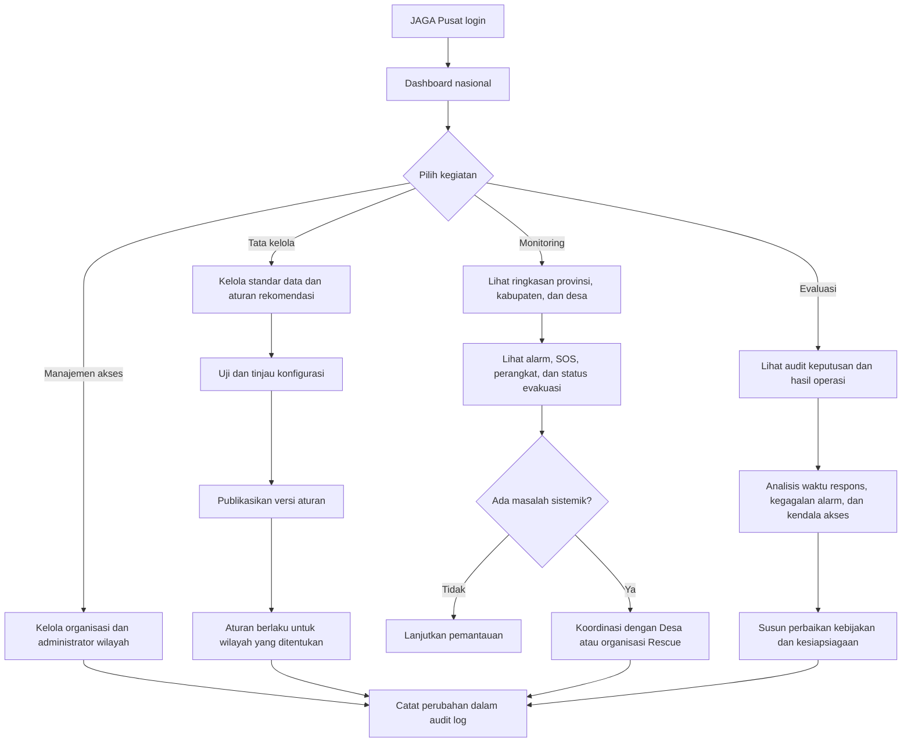
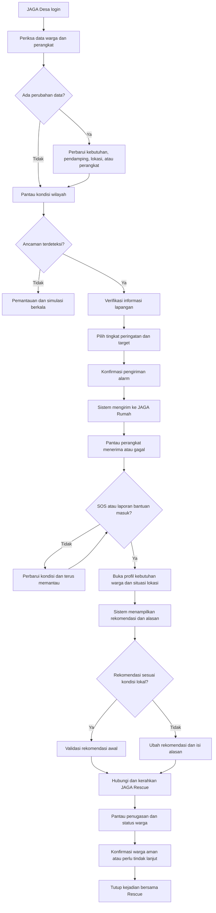
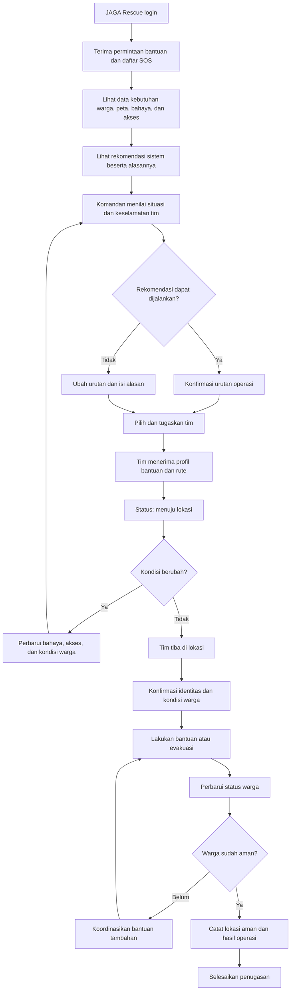
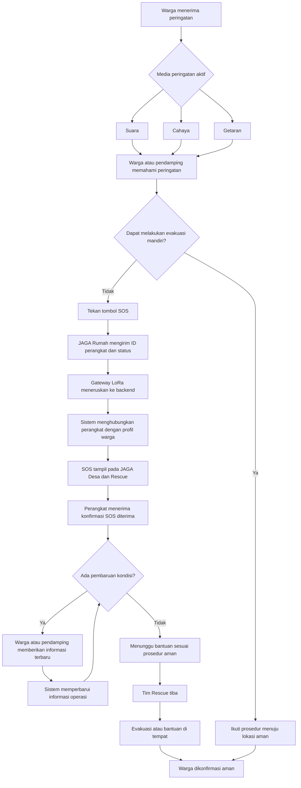

oke jadi ini aku bakal coba elaborasi ya sistem kita jadi sistem kita ada dua objek utama:

1. JAGA (Software)
2. JAGA Rumah (Hardware)

fitur di tiap objek:

1. JAGA Pusat:

* Pendataan warga disabilitas dengan triangle mulai dari desa lalu ke provinsi lalu ke nasional jadi dari desa lalu ke nasional yang utama tetap desa jadi sata nya terintegrasi.
* Role: JAGA Pusat, JAGA Desa, JAGA JAGA Rescue.
* lalu fitur yang menungkinkan admin menyalakan alaram di tiap rumah yang di install ke tiap rumah disabilitas untuk evakuasi.
* kemudian tiap peminimpin atau penanggung jawab dari JAGA Pusat dapat melihat data disabilitas di desa yang sudah di selamatkan jadi pemantauan disabilitas jadi lebih aware, yang mana mereka sering terlupakan dan memang harus mendapatkan perhatian khusu saat bencana.
* FItur menghubungi JAGA Rescue saat bencana.


2.  JAGA Rumah:

* Hardware yang berfungsi sebagai alaram unutuk rumah disabilitas dengan memberikan sinyal berupa suara, cahaya, dan getaran.
* lalu menggunakan LoRa dan baterai yang hemat karena hanya bekerja saat di aktifkan oleh tim JAGA Pusat.


3. JAGA Rescue:

* aplikasi yang sama yaitu JAGA tapi dengan role rescue atau sebagai tim penyelamat seperti damkar, tim SAR, dan organisasi kemanusiaan lainnya.
* lalu fitur map terintegrasi yang mempermudah tim rescue untuk locate rumah prioritas untuk di selamatkan.
* sistem pelacakan jejak pencarian untuk mempermudah tim penyelamat dalam tracking rute yang sudah mereka lalui sehingga mempermudah dan lebih efektif.
* kemudian saran rute penyelamatan tercepat dan efektif, sehingga jika di pedalaman ada rumah yang terisolasi jadi mudah di data. kemudian ada daerah yang rawan dan sulit di akses juga akan di highlight dengan warna merah, orange,  kuning.


jadi gimana menurut mu?

---

# Alur Operasional JAGA

## Prinsip pengambilan keputusan

JAGA adalah sistem pendukung keputusan, bukan pengganti keputusan petugas. Sistem
menyediakan informasi warga, kondisi kerentanan, lokasi, kondisi bahaya, status
perangkat, serta rekomendasi urutan penanganan yang dapat dijelaskan.

Pembagian tanggung jawab:

- **JAGA Desa** bertanggung jawab memutakhirkan data warga dan kondisi lokal,
  memvalidasi rekomendasi awal sistem, mengaktifkan peringatan, serta meminta
  bantuan Rescue.
- **Komandan JAGA Rescue** bertanggung jawab atas keputusan taktis dan urutan
  pelaksanaan evakuasi di lapangan berdasarkan kondisi nyata dan keselamatan tim.
- **JAGA Pusat** menetapkan standar dan konfigurasi aturan dasar, mengawasi
  operasi, serta mengevaluasi hasil dan audit keputusan.
- **Sistem JAGA** menghitung rekomendasi secara transparan, menampilkan alasan,
  memperbarui rekomendasi ketika kondisi berubah, dan mencatat setiap keputusan.

Petugas berwenang dapat mengubah rekomendasi sistem. Setiap perubahan wajib
disertai alasan dan disimpan dalam log audit. Jenis disabilitas tidak boleh menjadi
satu-satunya penentu. Penilaian mempertimbangkan kemampuan evakuasi mandiri,
kondisi bahaya terbaru, kebutuhan bantuan, keberadaan pendamping, akses lokasi,
dan sumber daya Rescue.

## Flowchart Input–Process–Output



## Flowchart logic JAGA Pusat



JAGA Pusat tidak memilih warga yang dievakuasi satu per satu. Pusat mengatur
standar, cakupan akses, pengawasan, dan evaluasi lintas wilayah.

## Flowchart logic JAGA Desa



JAGA Desa bertanggung jawab atas keakuratan informasi lokal dan keputusan awal,
tetapi keputusan taktis di lokasi operasi tetap berada pada komandan Rescue.

## Flowchart logic JAGA Rescue



Rescue berhak mengubah urutan karena kondisi lapangan dapat berbeda dari data
sistem. Sistem wajib menyimpan siapa yang mengubah, waktu perubahan, dan
alasannya.

## Flowchart logic warga pemegang kalung SOS



Jika jaringan internet terputus, komunikasi JAGA Rumah tetap dirancang melalui
LoRa menuju gateway. Perangkat perlu memberi umpan balik yang dapat dipahami
warga—misalnya pola cahaya atau getaran—ketika SOS sudah terkirim dan diterima.

---

# Akses Data Warga oleh JAGA Rescue

Prinsip: Rescue hanya melihat data pribadi warga **saat ada operasi**, dan hanya untuk **pemakai kalung** di **area terdampak**.

1. JAGA Desa menilai kondisi lapangan melalui pengamatan Keuchik dan pemuda desa, misalnya "air sungai naik, titik rendah desa sudah 1 meter").
2. Desa membunyikan alarm Siaga/Awas (boleh mengisi tinggi air dan catatan pengamatan).
3. Sistem otomatis membuka **operasi**; JAGA Rescue di wilayah itu menerima pemberitahuan dan roster pemakai kalung di area tersebut,
   termasuk paket offline untuk dibawa ke lapangan.
4. Desa dapat memperluas area atau memperbarui tinggi air selama operasi; alarm berikutnya meningkatkan operasi yang sama.
5. Setelah selesai, Desa menutup operasi dan akses Rescue dicabut. Semua pembukaan data oleh Rescue tercatat di audit.

Komandan Rescue tetap menentukan tim dan urutan evakuasi; sistem hanya menyediakan data dan rekomendasi.

---

# Tampilan per Role

Menu halaman semua role (Pusat, Desa, Rescue) berada di **sidebar kiri hijau tua** (logo dan menu saja). Baris atas konten memuat **chip peran**
("JAGA Pusat / Desa / Rescue"), status koneksi, notifikasi, dan avatar; nama pengguna, email, dan tombol keluar ada di menu avatar. Wilayah atau organisasi tampil kecil di
atas judul halaman. Di layar sempit sidebar menjadi baris menu yang dapat digeser. Mode tab masih tersedia (`nav: 'tabs'` per role di `ROLES`, `frontend/app.js`).

| Role | Menu | Isi |
|---|---|---|
| **JAGA Pusat** | Ringkasan | Cakupan provinsi dan desa, persediaan kalung, kendala teknis menunggu, operasi aktif (informasi), riwayat operasi |
| | Monitoring desa | Peta wilayah di atas, filter provinsi, lalu tabel per desa (warga, kalung online, baterai rendah, sinyal terakhir, operasi, nama kepala desa + tombol "Kontak" yang dikelola Pusat) |
| | Data warga | Pandangan baca saja, dikelompokkan per desa dengan filter provinsi dan desa |
| | Kalung | Inventaris: daftarkan kalung ke gudang Pusat, distribusikan ke desa atau tarik kembali |
| | Kendala teknis | Laporan dari Desa dan Rescue yang hanya dapat diselesaikan Pusat; mulai tangani dan selesaikan dengan catatan |
| | Pengumuman | Kirim pembaruan ke JAGA Desa dan JAGA Rescue (semua desa atau desa tertentu); prioritas "Penting" tampil sebagai banner |
| | Aturan prioritas | Aturan aktif dapat direvisi: buka editor lewat "Edit aturan", ubah poin, penjelasan, dan ambang warna, lalu "Simpan draf" atau "Aktifkan" dengan catatan; draf tampil sebagai pratinjau baca-saja sebelum diaktifkan |
| | Akun & akses | Daftar akun, buat akun, dan hapus akun (kecuali akun sendiri dan Pusat terakhir) |
| | Platform & data | Status basis data dan penyimpanan, mode demo, tautan dokumentasi |
| | Laporan | Riwayat operasi dan kejadian, unduh CSV |
| | Log audit | Tindakan penting termasuk akses data warga oleh Rescue |
| **JAGA Desa** | Beranda | Operasi berjalan (ubah tinggi air, tutup), KPI, peta desa, hal yang perlu ditindaklanjuti, status warga |
| | Warga | Daftar, cari, filter kelompok, tambah warga (termasuk kemampuan evakuasi dan medis mendesak) |
| | Alarm & operasi | Pilih tingkat, tinggi air dan catatan, pesan; konfirmasi manusia; riwayat alarm |
| | Kalung | Baterai, koneksi, posisi GPS, terakhir aktif; kalung baru atau pengganti diminta ke Pusat |
| | Kejadian | SOS dan aksi status (konfirmasi, aman, tutup) |
| | Titik evakuasi | Tambah, ubah, hapus titik kumpul desa |
| | Kendala teknis | Lapor ke Pusat (kalung, gateway, akun, data, aplikasi) dan lihat tanggapannya |
| | Peta | Peta desa dengan zona bahaya dan titik kumpul |
| **JAGA Rescue** | Prioritas | Peta berpin warna prioritas dan daftar urutan penyelamatan beserta alasannya |
| | Operasi | Roster pemakai kalung per operasi, unduh paket offline |
| | Tugas lapangan | Aksi status penanganan (terima, berangkat, tiba, evakuasi, aman) |
| | Tim | Status dan posisi tim; ubah status tim organisasi sendiri |
| | Kendala teknis | Lapor ke Pusat dan lihat tanggapannya |
| | Peta | Peta operasi |

**Halaman depan (`/`)** bersifat publik untuk semua pengguna: penjelasan singkat, kartu tiga peran (Desa, Rescue, Pusat) yang masing-masing menuju
`/login?role=...`, alur kerja, penjelasan prioritas warna, dan catatan privasi. Pengunjung yang sudah masuk melihat tombol "Buka dashboard". Alur URL:
`/` (landing) → `/login` → `/app` (dashboard sesuai peran). Pada mode demo, halaman masuk mengisi akun contoh sesuai peran yang dipilih.

## Pembagian tugas Pusat, Desa, dan Rescue

- **Siaga, Waspada, dan penanganan insiden** sepenuhnya di **JAGA Desa dan JAGA Rescue**. Hanya JAGA Desa yang membunyikan alarm (termasuk tombol sinyal darurat, yang wajib `confirm: true`). Pusat hanya menerima informasinya (operasi aktif, riwayat) untuk dipantau; Pusat tidak menangani insiden yang belum ditangani.
- **JAGA Pusat** menangani hal yang tidak bisa diselesaikan di tingkat desa: ketersediaan dan distribusi **kalung**, gateway, **akun**, data wilayah, **aturan prioritas**, **pengumuman** (ke JAGA Desa dan JAGA Rescue, seluruh desa atau desa tertentu; warga berkalung tidak menerima pesan karena alarm kalung sudah berupa suara, getar, dan lampu). JAGA Desa juga dapat membuat pesan yang diteruskan ke JAGA Rescue (`source_role = DESA`), dan **kontak kepala desa** (nama + nomor yang dipakai untuk menghubungi desa). Desa dan Rescue melaporkannya lewat menu **Kendala teknis**.
- **Alur kalung:**
  1. **Input:** JAGA Pusat mendaftarkan kalung ke sistem. Di lingkungan produksi, ini dilakukan secara massal (bulk import CSV atau via API dari pabrik), bukan satu per satu.
  2. **Key (Kunci):** Key yang dihasilkan saat kalung didaftarkan adalah token rahasia (secret) yang dimasukkan ke dalam firmware kalung agar dapat terautentikasi secara aman ke MQTT broker/server JAGA.
  3. **Distribusi:** JAGA Pusat mendistribusikan kalung ke desa. Di aplikasi produksi, ada fitur **distribusi massal** (pilih banyak kalung sekaligus, lalu kirim ke satu desa).
  4. **Aktivasi:** Kalung baru benar-benar diaktifkan dan datanya berguna ketika JAGA Desa memasangkan kalung tersebut kepada warga rentan di desanya.
  5. **Penanganan Kerusakan:** Kalung yang rusak, hilang, atau tidak berfungsi lagi **tidak dihapus** dari basis data agar riwayat audit (log) tetap utuh. Statusnya hanya diubah menjadi `BROKEN` atau `LOST`. Desa tidak mendaftarkan kalung sendiri; kalung yang terpasang pada warga tidak dapat dipindahkan sebelum dilepas.
- **Siapa itu JAGA Rescue:** organisasi penanggap apa pun (BPBD, Damkar, Basarnas, Polisi, TNI, layanan kesehatan, **relawan**). Relawan desa (mis. Tim Siaga Gampong, Tagana, linmas, pemuda desa) juga berperan sebagai Rescue: dibuatkan akun Rescue berjenis relawan dengan wilayah desanya. Data pilot memuat contoh "Tim Siaga Gampong Leubok Pusaka" (`rescue.siagadesa@jaga.id`).
- **Cakupan Pusat:** satu peran JAGA Pusat dengan hierarki wilayah (provinsi, kabupaten, kecamatan, desa). Saat ini Pusat melihat seluruh provinsi dan dapat memfilter per provinsi. Model data sudah mendukung pembagian lebih lanjut (wilayah layanan per organisasi), sehingga pengelola tingkat provinsi dapat ditambahkan nanti sebagai akun Pusat dengan wilayah terbatas tanpa mengubah struktur.

Peta memakai OpenStreetMap lewat Leaflet (tercantum di `frontend/vendor/leaflet`); membutuhkan internet untuk ubin peta, sedangkan pin
dan zona tetap tergambar tanpa ubin. Aset logo olahan (simbol transparan, versi putih, ikon PWA) ada di `frontend/assets`; berkas asli
`frontend/logo_jaga.jpeg` tetap disimpan.

---

# Prioritas Penyelamatan (warna di tampilan JAGA Rescue)

Pertanyaan: siapa yang perlu diselamatkan lebih dulu? **Tidak ada satu urutan resmi yang berlaku untuk semua kasus**, dan JAGA
tidak boleh menentukannya dari label kelompok saja (prinsip di bagian atas dokumen ini). Yang dipakai adalah prinsip triase yang
dapat dijelaskan: urutkan menurut *seberapa mendesak ancamannya* dan *seberapa mampu warga menyelamatkan diri*, lalu tambahkan
penanda kerentanan dengan bobot kecil.

## Urutan pertimbangan

1. **Ancaman langsung terhadap nyawa**: SOS aktif, air sudah masuk rumah (tinggi air), rumah di dalam zona bahaya, tinggi air umum yang
   diamati Desa.
2. **Tidak mampu menyelamatkan diri**: kemampuan evakuasi (mandiri, perlu bantuan, tidak bisa sendiri) dan apakah ada pendamping serumah.
   Orang yang tidak bisa mengungsi sendiri dan tinggal sendiri didahulukan.
3. **Kebutuhan medis yang tidak bisa ditunda**: insulin, oksigen, dialisis, persalinan dekat.
4. **Hambatan menerima peringatan**: tunarungu, tunanetra, disabilitas intelektual, autisme; perlu diberi tahu langsung.
5. **Penambah**: lanjut usia, hamil, tingkat kerentanan tinggi, akses desa sulit, malam hari, kalung offline, tanpa kontak darurat.

Konsekuensinya: penyandang disabilitas yang mandiri dan jauh dari bahaya tidak otomatis lebih prioritas daripada lansia yang tidak bisa
bangun dan tinggal sendiri; ibu hamil sehat berbeda dengan ibu hamil yang persalinannya dekat.

## Warna

| Warna | Level sistem | Skor (dummy) | Arti |
|---|---|---|---|
| Merah | DARURAT | 70 ke atas | Tangani lebih dulu |
| Oranye | RESPONS_CEPAT | 50 sampai 69 | Segera kirim bantuan |
| Kuning | SEGERA_TINJAU | 25 sampai 49 | Perlu ditinjau dan dipantau |
| Hijau | PANTAU | di bawah 25 | Pantau berkala |

Setiap kartu menampilkan alasan (aturan yang cocok) sehingga komandan bisa menilai dan mengubah keputusan. Warna berubah otomatis
saat kondisi berubah, misalnya Desa memperbarui tinggi air: pada data contoh, 1 warga merah pada air 40 cm menjadi 5 warga merah pada 120 cm.

## Bobot dummy (belum standar resmi)

| Aturan | Poin |
|---|---|
| SOS/insiden terbuka | +40 |
| Air di rumah ≥ 50 cm / ≥ 100 cm | +15 / +15 lagi |
| Zona bahaya risiko ≥ 4 (di dalam atau tepi) / risiko 3 | +15 / +8 |
| Tinggi air umum dari Desa ≥ 100 cm | +10 |
| Tidak bisa mengungsi sendiri / perlu bantuan | +30 / +10 |
| Tinggal sendiri | +15 |
| Medis tidak bisa ditunda | +30 |
| Sulit menerima peringatan (tunarungu, tunanetra, intelektual, autisme) | +10 |
| Hamil | +10 |
| Lansia | +5 |
| Tingkat kerentanan 4 atau 5 | +5 |
| Kalung offline | +10 |
| Akses desa sulit | +5 |
| Malam hari | +5 |
| Tanpa kontak darurat | +5 |

**Bobot ini hanya contoh untuk demo.** Sebelum dipakai di operasi nyata harus ditinjau dan disahkan JAGA Pusat bersama BPBD, Dinas
Sosial, bidan/tenaga kesehatan, dan organisasi penyandang disabilitas setempat. Aturan disimpan sebagai rule set berversi
(`priority_rule_sets`), jadi bobot dapat diubah tanpa mengubah kode.

## Data yang dibutuhkan agar prioritas akurat

- Kemampuan evakuasi mandiri dan kebutuhan medis mendesak harus diisi petugas desa (kolom terstruktur `evacuation_ability` dan
  `time_critical_medical`). Bila kosong, sistem tidak menebak dari teks bebas.
- Posisi rumah harus akurat agar status zona bahaya benar; zona bahaya perlu ditetapkan Desa/BPBD.
- Pada kehamilan, tingkat kerentanan (1 sampai 5) sebaiknya mengikuti usia kehamilan dan komplikasi, dan persalinan dekat ditandai medis mendesak.

## Keterbatasan saat ini

- Komandan Rescue baru dapat mengubah level lewat penilaian insiden (warga yang memiliki SOS); warga tanpa SOS belum bisa di-override.
- Belum ada pelatihan bobot dari data nyata; semuanya penilaian aturan yang dapat dijelaskan.

---

# Lokasi Pilot: tiga gampong di Kec. Langkahan, Kab. Aceh Utara

Gampong Leubok Pusaka (utama), Gampong Seureuke, dan Gampong Buket Linteung. Koordinat titik tengah dari OpenStreetMap. Dua desa tetangga masing-masing berisi 3 warga contoh (disabilitas, lansia, ibu hamil), kalung, satu titik kumpul, dan satu zona bahaya.

Pilot memakai satu desa. Seluruh warga, kalung, tim, insiden, dan aturan skor adalah **dummy**;
yang nyata hanya data wilayah publik.

## Alasan memilih Leubok Pusaka

1. **Terdampak banjir Sumatra 26 November 2025.** Kompas melaporkan kawasan Tanah Merah di desa ini sebagai lokasi terparah banjir di
   Aceh Utara: air sekitar 5 meter dan sekitar 200 KK terdampak.
2. **Fokus pada tingkat desa.** Sesuai desain sistem: JAGA Desa membunyikan alarm untuk seluruh desa, lalu Rescue menerima
   roster pemakai kalung di desa itu saja.
3. **Data wilayah resmi tersedia.** Kode wilayah 11.08.18.2021 (Kemendagri), kode pos 24394, Mukim Rampah, titik tengah 4.8479, 97.4728
   (OpenStreetMap, place=village; tepat di jalan terpetakan). Koordinat Wikidata (4.827, 97.416) ternyata meleset sekitar 6 km ke area hutan, jadi tidak dipakai. Titik tengah dipakai sebagai pusat sebaran koordinat dummy.
4. **Skala pilot dapat dikecilkan.** Desa dilaporkan besar (sekitar 764 KK dan 2.286 jiwa pada data 2019; belum
   terverifikasi), sehingga pilot dibatasi pada **9 warga berkalung**. Keuchik: Janni (label peran, belum dikonfirmasi).
5. **Konteks lokal sesuai asumsi sistem.** Keputusan bergantung pada pengamatan Keuchik dan pemuda desa: "air sungai
   naik, titik rendah desa sudah 1 meter". Itulah masukan yang dicatat sebagai tinggi air operasi.

## Skala data dummy

Dari angka yang dikumpulkan pemilik proyek, Aceh Utara memiliki sekitar 2.000 penyandang disabilitas. Dibagi rata per gampong
(sekitar 850; perlu dicek ke BPS) hasilnya sekitar 2 orang per desa. Fokus JAGA juga mencakup lansia dan ibu hamil, jadi seed
sengaja kecil dan seimbang: **satu desa, 9 warga berkalung**.

| Kelompok fokus | Jumlah | Warga (fiktif) |
|---|---|---|
| Disabilitas | 3 | pengguna kursi roda, tunarungu mandiri, tunanetra |
| Lansia | 3 | pasca-stroke tinggal sendiri, lansia bertongkat tinggal sendiri, lansia dengan insulin |
| Ibu hamil | 3 | persalinan dekat, tinggal sendiri 7 bulan, 5 bulan sehat |

Varian kasus sengaja dibuat berbeda-beda (tinggal sendiri vs bersama keluarga, di dalam vs di luar zona bahaya, mandiri vs tidak bisa
mengungsi) supaya prioritas berwarna menghasilkan merah, oranye, kuning, dan hijau. Bila perlu lebih kecil lagi, kurangi warga di
`backend/src/seed.ts`. Tes otomatis memakai satu desa fixture tambahan (hanya saat `JAGA_TEST_FIXTURES=true`) untuk menguji isolasi
antar desa; fixture itu bukan bagian data pilot.

## Yang nyata dan yang dummy

| Nyata (publik) | Dummy / placeholder |
|---|---|
| Kode wilayah, nama desa/kecamatan/kabupaten, titik tengah desa | Nama warga, telepon (0812-0000-xxxx), kontak, kerentanan, catatan medis |
| Kawasan Tanah Merah dan laporan dampaknya (Kompas) | Koordinat rumah dan titik acuan sebaran |
| Fakta banjir 26 November 2025 | Zona bahaya (batas perkiraan), titik kumpul usulan, catatan akses |
| | Kalung, gateway, tim BPBD/Damkar, insiden, alarm, aturan skor (bukan standar resmi) |

## Status data (diperbarui 5 Okt 2026)

| Data | Status | Siapa menyediakan |
|---|---|---|
| Wilayah (provinsi sampai desa, titik tengah) | Ada (publik) | selesai |
| Warga, kontak, kerentanan, kalung, tim, insiden, aturan skor | Ada, **dummy** | diganti data resmi lewat persetujuan Desa |
| Riwayat posisi GPS kalung dan notifikasi SOS contoh | Ada, dummy | tim kalung mengirim data nyata |
| Titik kumpul dan kapasitas | Usulan: meunasah, lapangan, sekolah (satu lantai, kondisi kurang baik, hanya cadangan). Kapasitas dummy. **JAGA Desa dapat menambah, mengubah, dan menghapus sendiri** (menu Titik evakuasi) | Desa memverifikasi lapangan |
| Zona banjir (batas) | **Belum** (perkiraan dummy). Rencana: turunkan dari citra Sentinel-1 (Copernicus Browser) tanggal banjir 26 Nov 2025 vs tanggal normal, bandingkan InaRISK BNPB, dan konfirmasi ke warga. Citra hanya memberi luas genangan, bukan kedalaman | Pemilik proyek mengekspor; BPBD memverifikasi |
| Proporsi dan sebaran disabilitas, lansia, ibu hamil | **Belum** (asumsi) | Dinas Sosial, Puskesmas/bidan, Keuchik |
| Bobot prioritas yang disahkan | **Belum** (bobot contoh) | Pusat bersama BPBD, Dinsos, tenaga kesehatan, organisasi disabilitas |
| Kunci kalung dan gateway produksi | **Belum** | dibuat saat kalung didaftarkan |
| Data tinggi air | Pengamatan manual Desa | dicatat saat alarm bila tersedia |

## Keterbatasan dan hal yang perlu diverifikasi

- Jumlah KK dan penduduk Leubok Pusaka berasal dari ringkasan pencarian; artikel sumbernya tidak dapat dibuka. Ada sumber yang
  menyebut desa ini di Kec. Seunuddon, tetapi Wikidata dan kode pos menempatkannya di Langkahan.
- Status desa pascabanjir (relokasi, kawasan yang hilang) belum dicek.
- Konsep dusun dihapus dari sistem; fokus pada desa. Migrasi `202610060001_hapus_dusun.sql` menghapus tabel dan kolom dusun.
- Proporsi disabilitas hanya asumsi. Jangan pernah mengganti data dummy dengan data warga sungguhan tanpa persetujuan dan dasar hukum (UU PDP).

---

# Kesesuaian dengan SRS JAGA v2.0

Tingkat peringatan memakai istilah BMKG/BNPB: **Normal, Waspada, Siaga, Awas**. Status: **Ada** = sudah berjalan di perangkat lunak; **Konsep** = bagian perangkat keras atau jaringan lapangan yang belum diperagakan oleh prototipe ini.

| Kode SRS | Kebutuhan | Status | Di mana |
|---|---|---|---|
| FR-1.1 | Kelola akun Desa/Rescue (buat, ubah, nonaktifkan, hapus) | Ada | Pusat: Akun & akses |
| FR-1.2 | Dasbor agregat, hasil evakuasi | Ada | Pusat: Ringkasan, Laporan |
| FR-1.3 | Status desa aktif/tidak dan sinkron terakhir | Ada | Pusat: Ringkasan (status desa), Monitoring desa |
| FR-1.4 | Ekspor laporan CSV/PDF | Ada | Pusat: Laporan (CSV dan cetak/PDF) |
| FR-1.5 | Konfigurasi global dan penyebaran versi | Ada | Pusat: Platform & data (pengaturan, versi aplikasi, sebaran firmware) |
| FR-1.6 | Tata kelola data sensitif (NIK tidak terlihat Desa/Rescue) | Ada | Pusat: Platform & data (matriks akses, persetujuan, akses Rescue); NIK tidak punya antarmuka |
| FR-1.7 | Pengumuman ke semua Desa dan Rescue | Ada | Pusat: Pengumuman |
| FR-1.8 | Log audit | Ada | Pusat: Log audit |
| FR-1.9 | Pusat tidak dapat membunyikan alarm | Ada | `POST /api/alerts` hanya JAGA Desa |
| FR-2.1 | Login tim desa serentak | Ada | Beberapa akun Desa per desa, sesi independen |
| FR-2.2 | Registri penerima (tambah, ubah, hapus) | Ada | Desa: Warga (Ubah, Nonaktifkan) |
| FR-2.3 | Pemicu alarm manual Desa | Ada | Desa: Alarm & operasi |
| FR-2.4 | Konfirmasi manusia sebelum alarm | Ada | Modal konfirmasi sebelum alarm dikirim |
| FR-2.5 | Alarm ke satu kalung, kelompok, atau semua | Ada | Desa: Alarm & operasi |
| FR-2.6 | Papan status per penerima | Ada | Desa: Status warga |
| FR-2.7 | Kerahkan tim Rescue dari dasbor | Ada | Desa: Status warga dan Kejadian |
| FR-2.8 | Baterai dan detak terakhir kalung | Ada | Desa: Kalung |
| FR-2.9 | Indikator offline dan store-and-forward | Ada | Antrean di peramban Desa; gateway mengunggah massal (`/api/gateway/ingest`) |
| FR-2.10, FR-2.11 | Riwayat kejadian, peta persebaran | Ada | Desa: Kejadian, Peta |
| FR-3.1, FR-3.2 | Login organisasi, umpan prioritas | Ada | Rescue: Prioritas |
| FR-3.3 | Peta prioritas dengan zona terisolasi (InaRISK) | Sebagian | Zona bahaya berwarna merah-oranye-kuning; lapisan InaRISK opsional (`INARISK_WMS_URL`) |
| FR-3.4 | Rute dan navigasi offline | Sebagian | Rute jalan (OSRM) saat online; offline berupa garis lurus dari data tersimpan |
| FR-3.5 | Pelacakan jalur dan area tersisir | Ada | Rescue: Tim (pelacakan) dan Peta (area tersisir) |
| FR-3.6 | Status ditemukan/dievakuasi, tidak ditemukan, tidak terjangkau | Ada | Rescue: Tugas lapangan |
| FR-3.7 | Koordinasi antar tim | Ada | Rescue: Tim dan Peta (semua tim yang melayani desa) |
| FR-3.8 | Peta offline | Ada | Rescue: Operasi (Unduh peta offline) dan cache otomatis |
| FR-3.9 | Laporan pasca-operasi | Ada | Rescue: Laporan operasi |
| FR-4.1 sampai FR-4.7 | Kalung: tidur dalam, alarm tiga media, tombol terkunci, detak, relay mesh, mandiri, ringkas | Sebagian | Perangkat lunak server: tombol terkunci dipaksa server (`409` bila belum ada alarm), `buttonUnlocked` pada inbox, detak dan baterai. Relay mesh dan daya adalah firmware (konsep) |

## Yang ditambahkan di luar SRS (dan alasannya)

- **Lansia dan ibu hamil** sebagai kelompok rentan, selain penyandang disabilitas.
- **Prioritas penyelamatan berskor** dengan alasan dan bobot yang dapat direvisi (menjawab "siapa lebih dulu").
- **GPS di kalung.** Dikirim saat detak dan saat meminta bantuan; Rescue memakainya hanya selama operasi aktif, dan Pusat tidak melihat GPS individu. Kebijakan dapat dimatikan di Platform & data.
- **Akses Rescue berbasis operasi.** Data pemakai kalung terbuka hanya selama operasi aktif di desanya dan tercatat di audit. Rescue juga melihat catatan medis, kebutuhan evakuasi, dan kontak darurat agar tahu cara memperlakukan warga; ini pengecualian terkendali terhadap NFR-3 dan dapat dikurangi lewat kebijakan Pusat.
- **Kendala teknis** (Desa/Rescue ke Pusat), **inventaris dan distribusi kalung** dari Pusat, rute Rescue ke warga, tombol sinyal darurat satu langkah (tetap dikonfirmasi Desa).

# Integrasi Kalung (untuk tim perangkat)

Bagian ini cukup bagi tim kalung (JAGA Alarm/JAGA Rumah), JAGA Sense, dan gateway; tidak perlu membaca kode backend. Contoh siap pakai: `firmware/api-examples.http`.

## Arsitektur

```
JAGA Sense --LoRa--> Gateway desa --HTTPS--> Backend JAGA --> Dashboard Desa / Rescue / Pusat
Kalung      --LoRa--> Gateway desa --HTTPS--/
```

- Kalung, sensor, dan gateway **tidak pernah** memegang kunci Supabase atau `.env`. Mereka hanya memegang kunci mereka sendiri.
- Kunci kalung berawalan `jrk_`, sensor `snk_`, gateway `gtw_`. Dibuat saat didaftarkan oleh JAGA Pusat dan **hanya ditampilkan sekali**. Rotasi: `POST /api/devices/:id/key`, `POST /api/sense/:id/key`, `POST /api/gateways/:id/key`. Backend hanya menyimpan hash kunci.
- Transport LoRa antara perangkat dan gateway ditentukan tim perangkat; backend hanya berbicara HTTPS. **Gateway adalah titik komando desa**: satu gateway per desa menjembatani LoRa dan internet, menyimpan peristiwa saat internet mati, lalu mengunggahnya bersamaan.

## Tombol kalung (SRS FR-4.3)

Tombol kalung **terkunci** dalam keadaan normal dan **terbuka hanya setelah JAGA Desa membunyikan alarm**. Menekannya berarti "meminta bantuan".

```
IDLE / TERKUNCI --(Desa bunyikan alarm)--> ALARM AKTIF / TOMBOL TERBUKA
ALARM AKTIF --(tombol ditekan)--> MEMINTA BANTUAN  (insiden dibuat, Desa dan Rescue diberi tahu)
MEMINTA BANTUAN atau ALARM AKTIF --(Rescue menandai warga aman/dievakuasi, atau operasi ditutup)--> IDLE / TERKUNCI
```

Server menegakkannya: `POST /api/device/sos` saat belum ada alarm aktif dijawab **409** (`ack: "TERKUNCI"`), jadi firmware tidak boleh mengirim permintaan bantuan sebelum tombol terbuka. Inbox mengabarkan `buttonUnlocked` (true selama ada alarm aktif atau warga masih menunggu bantuan).

## Autentikasi (header)

| Header | Wajib | Isi |
|---|---|---|
| `X-JAGA-Device-Id` / `X-JAGA-Device-Key` | kalung | mis. `JAGA-0003` dan kunci `jrk_...` |
| `X-JAGA-Sensor-Id` / `X-JAGA-Sensor-Key` | sensor | mis. `SENSE-0001` dan kunci `snk_...` |
| `X-JAGA-Gateway-Key` | gateway | kunci `gtw_...`; dipakai di `/api/gateway/*`, atau disertakan bersama kunci kalung bila meneruskan |

Kunci hanya diterima lewat header (bukan query string). Perangkat hilang atau dipensiunkan ditolak (403).

## Endpoint kalung

| Metode dan jalur | Tujuan | Isi penting |
|---|---|---|
| `POST /api/device/telemetry` | Detak berkala + posisi GPS | `battery` (0-100), `latitude`, `longitude`, `gpsFix`, `accuracyMeters`, `satellites`, `signalStrength`, `temperature`, `recordedAt` (ISO; untuk unggahan terlambat); semua opsional. Balas 202 |
| `POST /api/device/sos` | **Tombol ditekan (meminta bantuan)** | `latitude`, `longitude`, `gpsFix`, `accuracyMeters`, `description`. **409 bila tombol masih terkunci.** Balas 201 `ack: "SOS_DITERIMA"`, `incidentId`; permintaan yang masih terbuka tidak diduplikasi (`duplicate: true`) |
| `GET /api/device/inbox` | Ambil alarm | `commands[]` (`receiptId`, `severity`, `media`, `message`, `expiresAt`), `buttonUnlocked`, `activeSos`, `nextPollSeconds` |
| `POST /api/device/receipts/:receiptId` | Konfirmasi alarm dijalankan | `{"status":"ACKNOWLEDGED"}` atau `{"status":"FAILED","reason":"..."}` |
| `GET /api/device/location` | Info perangkat | lokasi tersimpan, baterai, status |

## Endpoint sensor JAGA Sense

| Metode dan jalur | Tujuan | Isi penting |
|---|---|---|
| `POST /api/sense/reading` | Bacaan muka air | `waterLevelCm` (wajib, 0-3000), `rainfallMmH`, `battery`, `recordedAt`. Balas 202 dengan `tier` (NORMAL/WASPADA/SIAGA/AWAS) |

Tingkat dihitung dari ambang per desa (bawaan 50/100/150 cm, diatur JAGA Desa). Hasilnya **rekomendasi**: Desa meninjau lalu memutuskan membunyikan alarm.

## Endpoint gateway desa

| Metode dan jalur | Tujuan | Isi penting |
|---|---|---|
| `GET /api/gateway/outbox` | Alarm yang harus diteruskan lewat LoRa | `commands[]` (`severity`, `media`, `message`, `expiresAt`, `targets[]` berisi `deviceId` dan `receiptId`), `unlockedDevices[]` (kalung yang tombolnya harus dibuka), `sense.thresholds` (agar gateway dapat mengklasifikasi saat offline), `nextPollSeconds` |
| `POST /api/gateway/ingest` | Unggahan massal store-and-forward (maks 200 kejadian) | `{"events":[{"type":"telemetry"\|"assist"\|"receipt"\|"sense", ...}]}`; tiap kejadian boleh memuat `recordedAt`. Balasan memuat hasil per kejadian (diterima atau alasan ditolak). Gateway hanya boleh memegang perangkat dan sensor di desanya |

## Alur yang harus didukung firmware

0. **GPS:** koordinat dikirim lewat detak dan permintaan bantuan. Bila belum dapat fix, kirim `gpsFix:false`; backend mempertahankan posisi terakhir dan tidak pernah memakai titik 0,0. Posisi dianggap segar bila diterima dalam 15 menit.
1. **Detak:** kirim telemetri berkala; kalung dianggap **offline bila tidak ada sinyal lebih dari 15 menit** (batas dapat diubah Pusat), jadi interval harus lebih pendek (usulan 5 menit).
2. **Alarm:** terima perintah (inbox atau gateway), jalankan sesuai `severity` dan `media`, lalu kirim konfirmasi. **Buka tombol** selama `buttonUnlocked` true. Alarm kedaluwarsa pada `expiresAt`.
3. **Meminta bantuan:** saat tombol terbuka dan ditekan, kirim `sos` dengan GPS saat itu; beri umpan balik cahaya/getaran saat `SOS_DITERIMA`. Bila gagal terkirim, ulangi (aman: tidak menduplikasi). Status penanganan kembali lewat `activeSos.statusLabel`.
4. **Offline:** gateway menyimpan kejadian dan mengunggahnya lewat `/api/gateway/ingest` begitu internet kembali, dengan `recordedAt` asli. Alarm baru yang dibunyikan Desa saat internet mati tidak dapat sampai ke server (alarm lewat dasbor butuh internet); jalur alarm lokal oleh gateway adalah bagian firmware (konsep).

## Pola alarm (USULAN, perlu disepakati dengan tim kalung)

| Tingkat | Cahaya | Getaran | Suara |
|---|---|---|---|
| WASPADA | kedip lambat | satu getar pendek | tidak ada atau nada lembut sekali |
| SIAGA | kedip sedang | getar putus-putus | nada berkala |
| AWAS | kedip cepat | getar kuat terus-menerus | nada keras terus-menerus |

Kombinasi tiga media penting karena penerima mencakup tunarungu (cahaya/getaran), tunanetra (suara), dan lansia. Autisme: hindari sirene keras bila memungkinkan.

## Yang belum ada (perlu dirancang bersama)

- Transport MQTT dan LoRa, sinkronisasi waktu perangkat, pembaruan firmware (OTA), dan relay mesh antar kalung (FR-4.5). Semuanya firmware/jaringan.
- Alarm lokal oleh gateway tanpa internet (SRS bagian 3): gateway memerlukan salinan alarm yang disetujui; saat ini alarm selalu lewat server.

## Status MQTT (penting untuk tim kalung)

**Backend saat ini hanya berbicara HTTP(S)**. Variabel `MQTT_URL`, `MQTT_USERNAME`, `MQTT_PASSWORD` di `.env.example` baru disiapkan; **belum ada kode yang berlangganan atau menerbitkan ke broker MQTT**. Pesan yang dikirim kalung ke broker tidak sampai ke aplikasi sampai salah satu terjadi:

1. **Gateway menjembatani** (berfungsi sekarang): gateway atau skrip kecil berlangganan topik MQTT lalu meneruskan ke endpoint di atas, paling efisien lewat `/api/gateway/ingest` dan `/api/gateway/outbox`.
2. **Jembatan MQTT di backend** (perlu dibangun): backend berlangganan `jaga/{deviceId}/telemetry|sos|receipt` dan menerbitkan alarm ke `jaga/{deviceId}/cmd`, memakai fungsi yang sama dengan endpoint HTTP. Bentuk topik dan muatan harus disepakati dengan tim kalung dulu.

## Konfigurasi kalung dan gateway (di mana disimpan)

Seluruh kode dan konfigurasi perangkat berada di bawah `firmware/` (struktur di dalamnya diatur tim perangkat; usulan `firmware/kalung/` dan
`firmware/gateway/`). Nilai yang perlu dikonfigurasi:

| Nilai | Contoh | Rahasia? | Simpan di |
|---|---|---|---|
| Alamat backend | `https://api.contoh.id` (dev: `http://<ip-laptop>:3000`) | tidak | `config.example.*` (di-commit) |
| ID kalung | `JAGA-0003` | tidak | `config.example.*` |
| **Kunci kalung** | `jrk_...` | **ya** | `secrets.*` atau `config.local.*` (tidak di-commit) |
| **Kunci gateway** | `gtw_...` | **ya** | `secrets.*` atau `config.local.*`, hanya di gateway |
| Interval detak | 5 menit (harus kurang dari 15) | tidak | `config.example.*` |
| Coba ulang SOS | ulang sampai berhasil | tidak | kode firmware |

Berkas `secrets.*`, `config.local.*`, hasil build (`*.bin`, `*.elf`, `.pio/`, `build/`) sudah diabaikan git. Sediakan `config.example.*` berisi nilai contoh
agar anggota baru tahu apa yang harus diisi. Satu kalung satu kunci; jangan memakai kunci yang sama untuk banyak kalung.

## Cara menguji tanpa Supabase

```powershell
npm install
npm run build
$env:JAGA_FORCE_MEMORY = "true"; npm start     # data pilot dummy di memori, tanpa .env
node scripts/demo-device-keys.mjs              # ID dan kunci kalung/gateway demo
```

Akun dashboard demo ada di README. Kunci demo hanya berlaku pada data dummy memori dan tidak boleh dipakai di produksi.

---

# Kebutuhan Data

Data dibagi menjadi tiga jenis: **publik** (boleh diambil dari sumber terbuka), **dummy** (dibangkitkan; wajib untuk data
pribadi), dan **kebijakan** (perlu pengesahan, bukan sekadar data). Seed (`backend/src/seed.ts`) memuat pilot Aceh Utara (1 desa, 9 warga dummy).

| Data | Tabel | Jenis | Sumber / catatan |
|---|---|---|---|
| Wilayah (provinsi → desa, kode, koordinat) | `provinces`, `regencies`, `districts`, `villages` | Publik | Kode Kemendagri/BPS; repo daftar wilayah Indonesia (mis. `cahyadsn/wilayah`, `emsifa/api-wilayah-indonesia`); batas dan koordinat desa dari BIG. |
| Zona bahaya (banjir, longsor, gempa) | `hazard_zones` | Publik | InaRISK BNPB, PVMBG/Badan Geologi, BMKG; kejadian historis dari DIBI BNPB. Simpan juga pusat dan radius (`center_latitude/longitude`, `radius_meters`). |
| Titik kumpul dan shelter | `evacuation_shelters` | Publik | OpenStreetMap lewat Overpass (`amenity=school`, `community_centre`, `townhall`, `shelter`); data BPBD bila ada. |
| Akses jalan dan medan | `villages.access_notes` | Publik | OSM (`highway`, `surface`), diubah menjadi catatan akses yang dipahami `geo.ts`. |
| Penduduk dan statistik disabilitas | `villages.population` | Publik (agregat) | BPS (Podes, Susenas); dipakai menakar jumlah warga dummy yang realistis. |
| Warga, kontak darurat, kerentanan per orang | `residents`, `resident_contacts`, `resident_vulnerabilities` | **Wajib dummy** | Data disabilitas dan medis adalah data pribadi spesifik (UU PDP); jangan pakai data asli tanpa persetujuan. |
| Kalung, gateway, telemetri | `devices`, `gateways`, `device_telemetry` | Dummy | Hardware belum ada; simulasikan lewat `/api/device/*`. |
| Insiden, penugasan, alarm, notifikasi | `incidents`, `incident_assignments`, `alert_commands`, `notifications` | Dummy | Dibuat saat simulasi/uji. |
| Tim rescue dan anggota | `rescue_teams`, `rescue_team_members` | Dummy | Nama instansi (BPBD, Damkar, Basarnas) boleh nyata; personelnya fiktif. |
| Rule set dan bobot skor, ambang | `priority_rule_sets`, `priority_rules`, `priority_thresholds` | Kebijakan | Untuk demo cukup dummy; untuk operasi nyata harus disahkan Pusat bersama pakar (acuan: Perka BNPB No. 14/2014 tentang penanganan penyandang disabilitas dalam penanggulangan bencana; cek ulang nomor dan isinya). |
| Akun | `profiles`, `internal_accounts` | Dummy | Kata sandi demo publik hanya untuk mode memori. |

Rencana yang berlaku: wilayah dan titik tengah desa dari data publik; seluruh data orang dan perangkat
dummy. Lokasi pilot, alasan, dan skala data ada di bagian "Lokasi Pilot" di atas.

---

# Riwayat perubahan

## 6 Okt 2026 — Pengumuman per desa, kepala desa dikelola Pusat, dan perbaikan UI aturan prioritas

**Pengumuman ke desa tertentu** (`#/pengumuman`, Pusat)
- `POST /api/announcements` menerima `villageIds` (daftar UUID desa tujuan, maks. 200, divalidasi); tanpa `villageIds` pengumuman menjangkau seluruh desa. `PATCH` salah satu kolom: `announcements.village_ids uuid[]` + GIN index.
- `GET /api/announcements` memfilter sesuai jangkauan: Pusat melihat semua; desa hanya menerima pengumuman yang ditujukan padanya (`scopeIds`).
- Form memilih "Semua desa" / "Desa tertentu" dengan daftar periksa desa; badge tujuan di riwayat; prioritas "Penting" tampil banner; draf ketikan tidak hilang saat berpindah mode tujuan.
- Migration baru: `supabase/migrations/202610100001_pengumuman_dan_kepala_desa.sql` (juga menambah kolom kepala desa). ~~Belum dijalankan di Supabase~~ → **sudah diterapkan sejak 7 Okt 2026**.

**Kepala desa milik JAGA Pusat**
- `listVillages` mengembalikan `headName`/`headPhone`; endpoint baru `PATCH /api/villages/:id` (khusus role Pusat) untuk memperbarui kontak — tercatat di audit (`VILLAGE_HEADS`).
- `#/desa`: nama kepala desa di bawah nama gampong + tombol "Kontak" membuka modal lihat/ubah.

**Perbaikan halaman Aturan prioritas (`#/aturan`)**
- Draf yang belum diaktifkan tampil sebagai kartu pratinjau baca-saja dengan tombol "Edit aturan"; editor ditutup otomatis setelah "Simpan draf" atau "Aktifkan". (Sebelumnya flag penutup dijalankan setelah re-render sehingga editor tidak pernah menutup sendiri.)
- Pemicuan ganda dicegah dengan **busy state global**: tombol aksi dan tombol submit dinonaktifkan dengan spinner selama permintaan berjalan (`setBusy`/`clearBusy`, CSS `.btn.is-busy`).
- Menghapus panggilan `refresh()` yang tidak terdefinisi pada "Revisi aturan" (potensi galat tak terlihat di konsol).

**Lain-lain**
- Pill navbar Pusat tidak lagi menampilkan hitungan "X/Y kalung" tersambung, cukup "Terhubung".
- `seed.ts` disesuaikan: kontak kepala desa (nama + nomor), satu pengumuman contoh yang ditujukan ke desa tetangga, dan pembersihan kolom `flood_*` yang sudah dihapus dari database agar reseed tidak gagal.
- Verifikasi: `npm run check`, `npm run build`, `npm run smoke` (215 lulus), dan uji endpoint fitur baru (kontak kades, pengumuman bertarget, cakupan desa) 11/11 lulus.

## 7 Okt 2026 — Audit kelayakan, perbaikan UX, dan putusan kesiapan produksi

**Status data & migrasi**
- Semua 12 migrasi kini **sudah diterapkan** di Supabase live — termasuk `202610100001_pengumuman_dan_kepala_desa.sql` yang sebelumnya belum berjalan (koreksi catatan "Belum dijalankan" di entri 6 Okt): terkonfirmasi `villages.head_name/head_phone` dan `announcements.village_ids` ada; `202610080001` terverifikasi via enum (`EVAKUASI` ditolak, `AWAS`/`NOT_FOUND`/`UNREACHABLE` valid).
- Akibatnya error 400 "kontak kepala desa" tertutup. **Belum**: data tidak di-seed ulang setelah migrasi → `head_name/head_phone` masih kosong (NULL), pengumuman contoh hanya 1 dari 2 (seed `seed.ts` disiapkan untuk keduanya). Putusan: jalankan `node scripts/seed-supabase.mjs --reset` saat siap mengisi data pilot.

**Perbaikan antarmuka (frontend)**
- Peta: layer "jalan" diganti ke **Esri World Street Map** (`app.js` ~741), `downloadTiles` disinkronkan dengan format tile `{z}/{y}/{x}`; `service-worker.js` mengizinkan host `server.arcgisonline.com`.
- Skala global diperkecil agar muat di layar laptop 14" pada zoom 100%: sidebar 252px, judul/tabel/kartu/tombol dirampingkan, margin halaman 36px (`styles.css`). Margin halaman depan dikoreksi (`min(1320px, 100% - clamp(64~128px))`) sehingga konten tidak "memakan layar".
- Kartu sebaris dibuat setinggi sama (flex column + `flex:1`) — menghapus ruang kosong di bawah kartu pendek.
- Rescue "Laporan operasi" (`#/laporan`): kartu "Laporan baru" & "Laporan organisasi Anda" ditumpuk **atas-bawah** (bukan samping) — tabel tidak lagi memicu scroll kanan-kiri; font seragam.
- Dropdown: `appearance:none` + chevron kustom agar konsisten antarbrowser.
- Error toast kini menampilkan `payload.detail` dari API → akar masalah (mis. penolakan DB) langsung terlihat.
- Data warga terdaftar (Pusat): grup per desa **collapsible** (klik baris desa untuk lipat/buka, chevron animasi).
- Pengumuman: tujuan baru **"Se-Kabupaten"** — pilih kabupaten, dikirim ke semua desa di kabupaten itu (dipetakan ke `villageIds` di front-end); label tombol & validasi disesuaikan.
- Konfirmasi berbahaya (nonaktifkan warga, hapus akun, buang draf, hapus titik evakuasi) diganti dari `confirm()` browser ke **modal konfirmasi kustom** (`askConfirm`, aksi `confirm-do`).
- Draf aturan prioritas: editor kini punya **nama draf + deskripsi** yang disimpan via `PATCH /api/rulesets/:id` (`JagaApi.updateRuleSet` ditambahkan di `api-client.js`; rute backend sudah ada).

**Putusan audit kelayakan (ringkas)**
- Web **siap dipakai sebagai pilot operasional sungguhan** (PUSAT–DESA–RESCUE): RBAC/scope, offline/PWA, peta, alur alarm–operasi–laporan teruji (215/215 smoke).
- **Belum siap produksi lapangan**: tidak ada perangkat kalung/gateway nyata (firmware masih contoh), SMS/WA/email/push tanpa delivery nyata (hanya antre `QUEUED`), BMKG/BNPB hanya istilah manual, status receipt `SENT` dihitung saat polling bukan saat alarm berbunyi.
- Prioritas perbaikan yang diputuskan:
  1. Matikan jejak demo di produksi: `SEED_DEMO_PASSWORDS=false`, `JAGA_DEMO_HEARTBEAT=false`, rapikan urutan `store-boot.ts` (guard memori bisa dilewati), nonaktifkan `X-JAGA-Role` (dev bypass yang ikut diekspos di `/api/config`).
  2. Keamanan koneksi: SSE bocor lintas desa (`realtime.ts` mengirim event tanpa `villageId` ke semua subscriber) + batasi koneksi; rate limit endpoint ingest device/gateway; timeout/retry ke Supabase.
  3. Sembunyikan detail DB di respons error (502/503); isi `ip_address`/`user_agent` di audit (saat ini null padahal audit menyimpan salinan PII warga).
  4. Perbarui `README.md` (daftar migrasi berhenti di `…080002`; tambah `…090001` & `…100001`) dan bagian kalung di dokumen ini (hapus referensi JAGA Sense yang sudah dihapus); tambah skrip verifikasi migrasi.
  5. Bila menuju produksi penuh: RLS policy di DB, kunci perangkat acak di seed, worker pengirim notifikasi nyata, perangkat kalung/gateway sungguhan.

**Verifikasi hari ini**
- `npm run check`, `npm run build`, `npm run smoke` (215/215 lulus); `node --check` untuk `app.js` & `api-client.js`; keseimbangan kurung `styles.css` (379/379). Status migrasi live dicek via probe PostgREST read-only — terpasang penuh.

### Ambang Warna Aktif (Thresholds)
Ambang warna aktif menentukan batas total skor kerentanan untuk pengelompokan prioritas. Misalnya, jika skor di atas 80 maka warga masuk kategori Merah (Kritis), 50-79 Oranye, dan seterusnya. Aturan dan bobot skor (seperti Lansia +20, Hamil +15) diatur di Aturan Prioritas Banjir.

### Siapa Melihat Apa (Matrix Akses Data)
- **JAGA Pusat**: Hanya melihat data agregat (jumlah warga rentan). Tidak melihat data detail/NIK warga.
- **JAGA Desa**: Melihat data detail dan status warganya sendiri (karena mereka yang mendaftarkan), tapi NIK tetap disembunyikan/di-masking.
- **JAGA Rescue**: Sama sekali diblokir dari melihat NIK dan privasi warga secara normal. Rescue baru diberi hak akses 30 hari ke data warga (lokasi rumah, kondisi medis, nomor darurat) HANYA saat status bencana (Siaga/Awas) aktif agar bisa mengevakuasi mereka.
